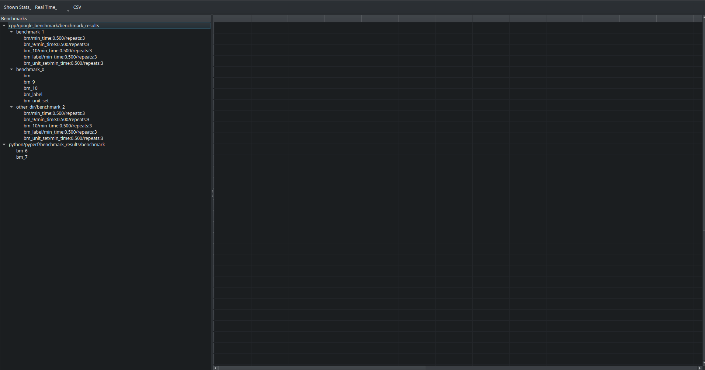
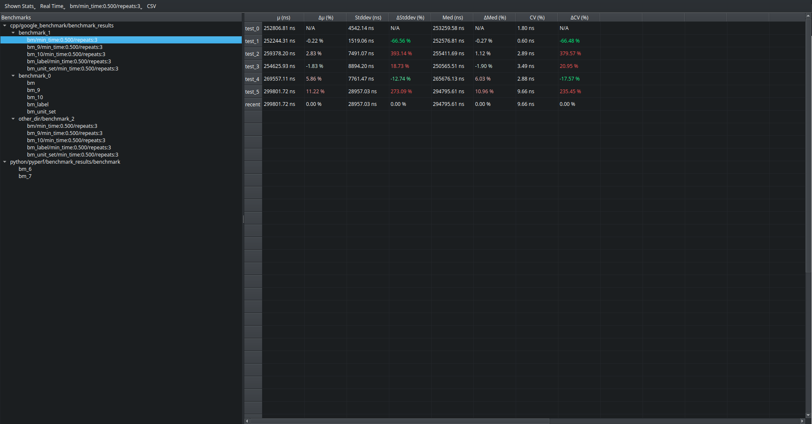
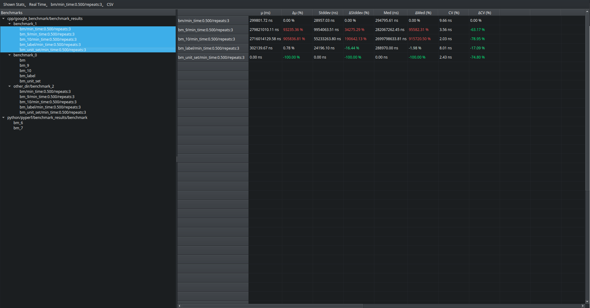

# CCBenchmark
A Benchmark visualization, and comparison tool. **Note:** This project is currently not production ready.

## Usage
### Creating Settings file
Create a ```.ccbenchmark``` folder in your workspace:
```bash
mkdir .ccbenchmark
```
Create a ```settings.yaml``` file in the ```.ccbenchmark``` folder:
```bash
touch .ccbenchmark/settings.yaml
```
Add the following content to the ```settings.yaml```:
```yaml
<LANGUAGE_IN_USE>.<BENCHMARKING_FRAMEWORK_IN_USE>:
  benchmark_runnables: 
    - <PATH_TO_RUNNABLE_FILE>

  output_dir: <PATH_TO_WHERE_OUTPUT_FILES_ARE_MADE>

  output_format: <VALID_OUTPUT_FORMAT_FOR_FRAMEWORK_BEING_USED>
```
### Running Benchmarks
Once the ```settings.yaml``` file has been initiated, run:
```bash
ccbenchmark r <ITERATION_NAME>
```
This will execute the benchmarks and generate output files.
### Comparing Benchmarks
To view and compare benchmark results, run:
```bash
ccbenchmark c
```
### Using the GUI
#### Benchmark Selection
Benchmarks are organized by the location of their runnable files:


Select one benchmark to compare it against its iterations:


Select multiple benchmarks to compare recent results against each other:


#### Toolbar Interactions

- **Shown Stats**: Toggle unwanted columns.
- **Real Time / CPU Time**: Select which time type to view.
- **Benchmark Name**: Displays the currently selected benchmark. In multi-select mode, click it to choose which benchmark the others are compared against.
- **CSV**: Export current table as CSV

## Installation
### Development Installation
1. Clone the repository:
```bash
git clone https://github.com/garthable/ccbenchmark.git
cd ccbenchmark
```
2. Install ```maturin``` (if not already installed):
```bash
pip install maturin
```
3. Create and activate a python virtual environment:
```bash
python -m venv py_venv
source py_venv/bin/activate
```
4. Install package for development:
```bash
maturin develop
```
### Installation for Use 
1. Clone the repository:
```bash
git clone https://github.com/garthable/ccbenchmark.git
cd ccbenchmark
```
2. Install ```maturin``` (if not already installed):
```bash
pip install maturin
```
3. Build and install the package:
```bash
maturin build --release
pip install rust/target/wheels/ccbenchmark*.whl
```